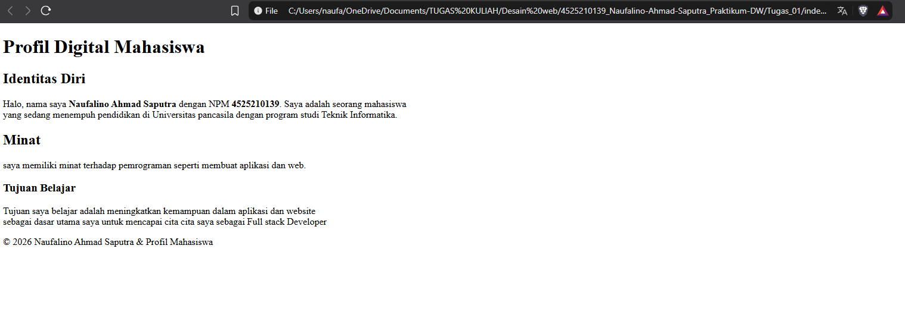

# Laporan Tugas Praktikum 1

## 1. Deskripsi Project

Buat halaman biodata pribadi dengan minimal satu h1, dua h2/h3, empat paragraf, strong/em, line break, dan tiga
HTML entity.

**Studi Kasus**

Seorang mahasiswa ingin membuat halaman profil digital sederhana untuk diperkenalkan pada kegiatan organisasi
kampus. Halaman harus memuat identitas, program studi, minat, tujuan belajar, dan keterangan hak cipta. Fokus studi
kasus adalah struktur yang benar dan hierarki informasi, bukan dekorasi visual.

---

## 2. Hasil Output

Berikut merupakan hasil tampilan halaman web setelah file `index.html` dijalankan menggunakan browser.

### Tampilan Output

## 3. Checklist Tugas
- Satu h1
- dua h2/h3
- Empat Paragraf
- menggunakan strong/em
- Menggunakan line break
- Menggunakan tiga HTML entity.

## Ringkasan Perubahan, Masalah, dan Solusi

Pada tugas ini dilakukan perubahan dengan membuat sebuah halaman biodata pribadi menggunakan HTML5. Halaman tersebut berisi informasi mengenai identitas, program studi, minat, serta tujuan belajar. Struktur halaman dibuat menggunakan elemen HTML seperti `<h1>`, `<h2>`, `<h3>`, dan `
` . Selain itu, digunakan `<strong>` dan `<em>` untuk memberikan penekanan pada teks, ` ` untuk membuat perpindahan baris, serta HTML entity seperti `&copy;`,dan `&amp;` untuk menampilkan karakter khusus.

Masalah yang ditemukan dalam pembuatan halaman adalah pemahaman mengenai struktur dasar HTML dan penggunaan karakter khusus. Beberapa karakter seperti `<` dan `>` memiliki fungsi khusus dalam HTML sehingga jika ditulis secara langsung dapat dianggap sebagai bagian dari tag oleh browser. Selain itu, tampilan halaman perlu dapat menyesuaikan ukuran layar perangkat.

Solusi yang digunakan adalah menerapkan struktur HTML dengan benar menggunakan `<!DOCTYPE html>`, `<html>`, `<head>`, dan `<body>`. Pada bagian `<head>` juga digunakan `meta charset="UTF-8"` dan `meta viewport` agar karakter dapat ditampilkan dengan benar dan halaman dapat menyesuaikan perangkat. Untuk karakter khusus digunakan HTML entity.

