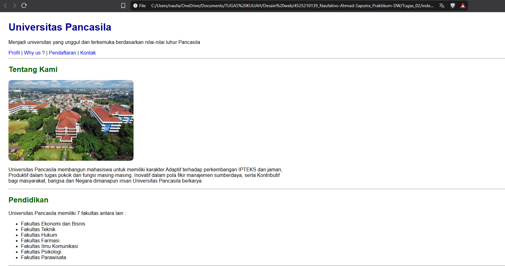
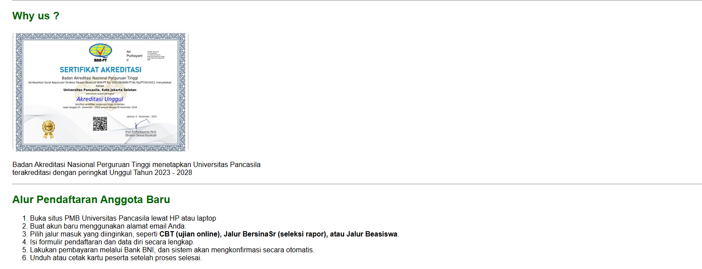
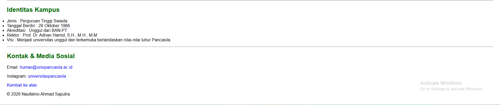

# Laporan Tugas Praktikum — Halaman Profil Organisasi Kampus

## 1. Deskripsi Tugas
Buat halaman profil organisasi kampus dengan minimal dua gambar ber-alt, empat link (termasuk anchor internal,
external, dan mailto), serta ketiga tipe list.

### Studi Kasus
Sebuah sekolah membutuhkan halaman profil statis yang mampu menyajikan identitas, foto gedung, program
keahlian, alur pendaftaran, serta akses ke media sosial dan email. Mahasiswa bertindak sebagai pengembang
awal yang menyusun struktur konten sebelum desain visual dikerjakan.


## 2. Struktur Folder
```
[Tugas_02]/
├── index.html
├── css/
│   └── style.css
└── images/
    ├── [gedung].jpg
    └── [akreditasi].jpg
```

## 3. Ketentuan Tugas yang Dipenuhi
| Ketentuan | Implementasi |
|---|---|
| Minimal 2 gambar ber-`alt` | `` pada bagian *Profil* dan *Why us ?*, masing-masing dengan atribut `alt` deskriptif |
| Minimal 4 link | Anchor internal (`#profil`, `#Why us ?`, `#pendaftaran`, `#kontak`), eksternal (Instagram `target="_blank"`), dan `mailto:` |
| Ketiga tipe list | `<ul>` untuk program , `<ol>` untuk alur pendaftaran, `<dl>` untuk identitas |


## 4. Ringkasan perubahan, masalah, dan solusi

halaman ini memuat identitas organisasi, program kerja, dokumentasi kegiatan, alur
pendaftaran anggota, struktur pengurus, serta kontak resmi. Struktur folder
mengikuti pola yang diajarkan di kelas: `index.html` di root, `css/style.css`
untuk styling, dan folder `images/` untuk aset gambar.

Dari sisi konten, halaman ini menggunakan ketiga jenis list sesuai
kebutuhanya masing-masing seperti: `<ul>` untuk daftar Fakultas
, `<ol>` untuk pendaftaran dan `<dl>` untuk identitas.

Untuk tautan, digunakan empat jenis: anchor internal untuk navigasi dalam
satu halaman, tautan eksternal dengan `target="_blank"`, serta tautan
`mailto:` untuk kontak email.


## 5. Output





## 6. Cara Menjalankan
1. Buka folder project.
2. Buka file `index.html` langsung menggunakan browser, atau
3. Gunakan ekstensi **Live Server** di VS Code untuk preview otomatis.